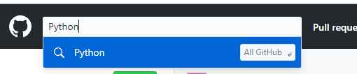
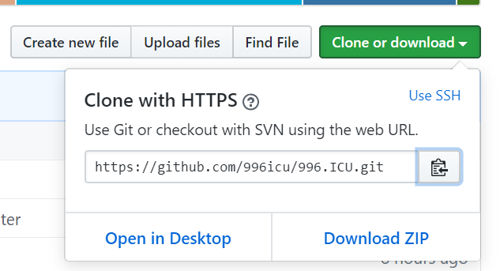
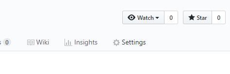

GIT
==========================


## 版本控制

1.集中式

```
svn因为每次存的都是差异 需要的硬盘空间会相对的小一点  可是回滚的速度会很慢
优点: 
    代码存放在单一的服务器上 便于项目的管理
缺点: 
    服务器宕机: 员工写的代码得不到保障
    服务器炸了: 整个项目的历史记录都会丢失
```

2.分布式

```
git每次存的都是项目的完整快照 需要的硬盘空间会相对大一点
    (Git团队对代码做了极致的压缩 最终需要的实际空间比svn多不了太多 可是Git的回滚速度极快)
优点:
    完全的分布式
缺点:    
    学习起来比SVN陡峭
```

## GIT简介

1. 什么是GIT

> git是一个开源的分布式版本控制系统，用于高效的管理各种大小项目和文件。

2. 代码管理工具的用途

>* 防止代码丢失，做备份
>* 项目的版本管理和控制，可以通过设置节点进行跳转
>* 建立各自的开发环境分支，互不影响，方便合并
>* 在多终端开发时，方便代码的相互传输

3. git的特点

>* git是开源的，多在*nix下使用，可以管理各种文件
>* git是分布式的项目管理工具(svn是集中式的)
>* git数据管理更多样化，分享速度快，数据安全
>* git 拥有更好的分支支持，方便多人协调

4. git安装

   linux

> sudo apt-get install git

​       windows:

>  https://git-scm.com/downloads 

## GIT使用图示


## GIT配置

| 配置           | 使用                | 说明                     |
| -------------- | ------------------- | ------------------------ |
| /etc/gitconfig | git confit --system | 系统对所有用户适用的配置 |
| ~/.gitconfig   | git config --global | 用户目录下只适用该用户   |
| .git/config    |                     | 配置只对当前项目有效     |

> 每一个级别的配置都会覆盖上一层相同配置

### git用户信息

```
git config --global user.name 'hzy'            #配置用户名
git config --global user.email hzy@163.com     #配置邮箱
git config --list                              #查看已有配置信息
git config --global --unset user.email         #删除配置信息
```


## GIT对象

### .git目录

```
+hooks                  #目录包含客户端或服务端的钩子脚本
+info                   #包含一个全局性排除文件
+logs                   #保存日志信息
+objects                #目录存储所有数据内容
+refs                   #目录存储指向数据的提交对象的指针（分支）
COMMIT_EDITMSG
config                  #文件包含项目特有的配置选项
description             #用来显示对仓库的描述信息
HEAD                    #文件指示目前被检出的分支
index                   #文件保存暂存区信息
```


## GIT命令


### 基本概念

* 工作区：项目所在操作目录，实际操作项目的区域
* 暂存区: 用于记录工作区的工作（修改）内容
* 仓库区: 用于备份工作区的内容
* 远程仓库: 远程主机上的GIT仓库

>注意： 在本地仓库中，git总是希望工作区的内容与仓库区保持一致，而且只有仓库区的内容才能和其他远程仓库交互。

### 初始配置

>配置命令: git config

>* 配置所有用户： git config --system [选项]
>> 配置文件位置:  /etc/gitconfig

>* 配置当前用户： git config --global [选项]
>> 配置文件位置:  ~/.gitconfig

>* 配置当前项目： git config  [选项]
>> 配置文件位置:  project/.git/config

1. 配置用户名

```
e.g. 将用户名设置为Tedu
sudo git config --system user.name Tedu
```

2. 配置用户邮箱

```
e.g. 将邮箱设置为lvze@tedu.cn
git config --global user.email lvze@tedu.cn
```

3. 配置编译器

```
e.g. 配置编译器为pycharm
git config core.editor pycharm
```

4. 查看配置信息

```
git config --list
```

### 基本命令

1. 初始化仓库

> git  init 
> 意义：将某个项目目录变为git操作目录，生成git本地仓库。即该项目目录可以使用git管理

2. 查看本地仓库状态

> git  status
> 说明: 初始化仓库后默认工作在master分支，当工作区与仓库区不一致时会有提示。

3. 将工作内容记录到暂存区

> git add [files..]

```
e.g. 将 a ，b 记录到暂存区
git add  a b

e.g. 将所有文件（不包含隐藏文件）记录到暂存区
git add  *
```

4. 取消文件暂存记录

>  git rm --cached [file] 

5. 将文件同步到本地仓库

> git commit [file] -m [message]
> 说明: -m表示添加一些同步信息，表达同步内容

```
e.g.  将暂存区所有记录同步到仓库区
git commit  -m 'add files'
```

6. 查看commit 日志记录

> git log
> git log --pretty=oneline

7. 比较工作区文件和仓库文件差异

> git diff  [file]

8. 将暂存区或者某个commit点文件恢复到工作区

> git checkout [commit] -- [file]
>
> * --是为了防止误操作，checkout还有切换分支的作用

9. 移动或者删除文件

> git  mv  [file] [path]
> git  rm  [files]
> 注意: 这两个操作会修改工作区内容，同时将操作记录提交到暂存区。

------------------------------
####@扩展延伸
在Git项目中可以通过在项目的某个文件夹下定义.gitignore文件的方式，规定相应的忽略规则，用来管理当前文件夹下的文件的Git提交行为。.gitignore 文件是可以提交到公有仓库中，这就为该项目下的所有开发者都共享一套定义好的忽略规则。在.gitingore 文件中，遵循相应的语法，在每一行指定一个忽略规则。

```
.gitignore忽略规则简单说明

`#`               表示此为注释,将被Git忽略
*.a             表示忽略所有 .a 结尾的文件
!lib.a          表示但lib.a除外
/TODO           表示仅仅忽略项目根目录下的 TODO 文件，不包括 subdir/TODO
build/          表示忽略 build/目录下的所有文件，过滤整个build文件夹；
doc/*.txt       表示会忽略doc/notes.txt但不包括 doc/server/arch.txt
 
bin/:           表示忽略当前路径下的bin文件夹，该文件夹下的所有内容都会被忽略，不忽略 bin 文件
/bin:           表示忽略根目录下的bin文件
/*.c:           表示忽略cat.c，不忽略 build/cat.c
debug/*.obj:    表示忽略debug/io.obj，不忽略 debug/common/io.obj和tools/debug/io.obj
**/foo:         表示忽略/foo,a/foo,a/b/foo等
a/**/b:         表示忽略a/b, a/x/b,a/x/y/b等
!/bin/run.sh    表示不忽略bin目录下的run.sh文件
*.log:          表示忽略所有 .log 文件
config.php:     表示忽略当前路径的 config.php 文件
 
/mtk/           表示过滤整个文件夹
*.zip           表示过滤所有.zip文件
/mtk/do.c       表示过滤某个具体文件
```
-------------------------------


### 版本控制

1. 退回到上一个commit节点

> git reset --hard HEAD^
> 注意 ： 一个^表示回退1个版本，依次类推。当版本回退之后工作区会自动和当前commit版本保持一致

2. 退回到指定的commit_id节点

> git reset --hard [commit_id]

3. 查看所有操作记录

>git reflog
>注意:最上面的为最新记录，可以利用commit_id去往任何操作位置

4. 创建标签

>标签: 在项目的重要commit位置添加快照，保存当时的工作状态，一般用于版本的迭代。

> git  tag  [tag_name] [commit_id] -m  [message]
> 说明: commit_id可以不写则默认标签表示最新的commit_id位置，message也可以不写，但是最好添加。

```
e.g. 在最新的commit处添加标签v1.0
git tag v1.0 -m '版本1'
```

5. 查看标签

>git tag  查看标签列表
>git show [tag_name]  查看标签详细信息

6. 去往某个标签节点

> git reset --hard [tag]

7. 删除标签

> git tag -d  [tag]


### 保存工作区

1.  保存工作区内容

> git stash save [message]
> 说明: 将工作区未提交的修改封存，让工作区回到修改前的状态

2. 查看工作区列表

> git stash  list
> 说明:最新保存的工作区在最上面

3. 应用某个工作区

> git stash  apply  [stash@{n}]

4. 删除工作区

> git stash drop [stash@{n}]  删除某一个工作区
> git stash clear  删除所有保存的工作区


### 分支管理

>定义: 分支即每个人在原有代码（分支）的基础上建立自己的工作环境，单独开发，互不干扰。完成开发工作后再进行分支统一合并。

1. 查看分支情况

> git branch
> 说明: 前面带 * 的分支表示当前工作分支

2. 创建分支

> git branch [branch_name]
> 说明: 基于a分支创建b分支，此时b分支会拥有a分支全部内容。在创建b分支时最好保持a分支"干净"状态。

3. 切换工作分支

> git checkout [branch]
> 说明: 2,3可以同时操作，即创建并切换分支
>
> > git checkout -b [branch_name]

4. 合并分支

> git merge [branch]

> 冲突问题是合并分支过程中最为棘手的问题
>> 当分支合并时，原分支和以前发生了变化就会产生冲突
>> 当合并分支时添加新的模块（文件），这种冲突可以自动解决，只需自己决定commit操作即可。
>> 当合并分支时两个分支修改了同一个文件，则需要手动解决冲突。

5. 删除分支

> git branch -d [branch]  删除分支
> git branch -D [branch]  删除没有被合并的分支


### 远程仓库

1. 什么是远程仓库

> 远程主机上的git仓库。实际上git是分布式结构，每台主机的git仓库结构类似，只是把别人主机上的git仓库称为远程仓库。

2. 共享仓库

> 在git仓库中bare属性为True的共享仓库可以很好的和远程仓库进行交互

创建步骤：

* 选择共享仓库目录，将该目录属主设置为当前用户

```
mkdir gitrepo
chown tarena:tarena gitrepo
```

* 将该目录初始化为git共享目录，下例中tedu为自己取的项目名称，.git为通用结尾后缀

```
cd gitrepo
git init --bare tedu.git
```

* 将git配置目录与项目目录设置为相同的属主

```
chown -R tarena:tarena tedu.git
```

#### 远程仓库操作命令

所有操作在本地git仓库下进行

1. 添加远程仓库

```
git remote  add origin tarena@127.0.0.1:/home/tarena/gitrepo/tedu.git
```

2. 删除远程主机

>git remote rm [origin]

3. 查看连接的主机

>git remote
>注意: 一个git项目连接的远程主机名不会重复

4. 将本地分支推送给远程仓库

```
将master分支推送给origin主机远程仓库，第一次推送分支使用-u表示与远程对应分支建立自动关联
git push -u origin  master
```

5. 删除远程分支

> git branch -a  查看所有分支
> git push origin  [:branch]  删除远程分支

6. 其他推送方法

> git push --force origin  用于本地版本比远程版本旧时强行推送本地版本

> git push origin [tag]  推送本地标签到远程

> git push origin --tags  推送本地所有标签到远程

> git push origin --delete tag  [tagname]  删除远程仓库标签

1. 从远程获取项目

```
git clone tarena@127.0.0.1:/home/tarena/gitrepo/tedu.git
```

> 注意： 获取到本地的项目会自动和远程仓库建立连接。且获取的项目本身也是个git项目。

8. 从远程获取代码

> git pull 

> 将远程分支master拉取到本地，作为tmp分支
> git fetch origin  master:tmp  

> 区别
>> pull将远程内容直接拉取到本地，并和对应分支内容进行合并
>> fetch将远程分支内容拉取到本地，但是不会和本地对应分支合并，可以自己判断后再使用merge合并。


## GitHub使用

### 介绍

>github是一个开源的项目社区网站，拥有全球最多的开源项目。开发者可以注册网站在github建立自己的项目仓库。

>网址： github.com

>代码管理工具：git

### 获取项目

* 在左上角搜索栏搜索想要的获取的项目



* 选择项目后复制项目git地址



* 在本地使用git clone方法即可获取

### 创建git仓库

* 点击右上角加号下拉菜单，选择新的仓库


* 填写相应的项目信息即可

* github仓库相对本地主机就是一个远程仓库 通过remote连接，如果需要输入密码输   入github密码即可。连接后即可使用远程仓库操作命令操作。readme文件会被自动作为项目介绍
  
* 如果是在即的仓库在仓库界面选择settings，在最后可以选择删除仓库




### 添加ssh秘钥

如果使用http协议访问github则每次都需要输入密码，如果是自己的私人计算机可以使用ssh协议访问，添加秘钥后则不再需要每次输入密码。

* 登录github账号  
  
* 右上角头像下拉菜单--》settings --》左侧 SSH and GPG keys --》new ssh key --》填写title，将私人计算机公钥内容加入key文本框 点击add...


## 基本命令

git --version  查看git版本信息


# 远程仓库

### 一、忽略内容

一般我们总会有些文件无需纳入 Git 的管理，也不希望它们总出现在未跟踪文件列表。通常都是些自动生成的文件，比如日志文件，或者编译过程中创建的临时文件等。我们可以创建一个名为 .gitignore 的文件，列出要忽略的文件模式。

.gitignore文件规范

```
所有空行或者以注释符号 ＃ 开头的行都会被 Git 忽略。
可以使用标准的 glob 模式匹配。
* 代表匹配任意个字符
？代表匹配任意一个字符
**代表匹配多级目录
匹配模式前跟反斜杠（/） 这个斜杠代表项目根目录
匹配模式最后跟反斜杠（/）说明要忽略的是目录。
要忽略指定模式以外的文件或目录，可以在模式前加上惊叹号（!）取反。
```

EG:

```
# 此为注释 – 将被 Git 忽略
# 忽略所有 .a 结尾的文件      --->    *.a
# 但 lib.a 除外             --->    !lib.a
# 仅仅忽略项目根目录下的 TODO 文件，不包括 subdir/TODO  ----->  /TODO
# 忽略 build/ 目录下的所有文件                       ---->    build/
# 会忽略 doc/notes.txt 但不包括 doc/server/arch.txt   ---->  doc/*.txt
# 忽略 doc/ 目录下所有扩展名为 txt 的文件             ---->  doc/**/*.txt
```

[具体可以参考](https://github.com/github/gitignore)https://github.com/github/gitignore

### 二、远程仓库概述

​        为了能在任意 Git 项目上团队协作，你需要知道如何管理自己的远程仓库。 远程仓库是指托管在因特网或其他网络中的你的项目的版本库。你可以有好几个远程仓库，通常有些仓库对你只读，有些则可以读写。 **与他人协作涉及管理远程仓库以及根据需要推送或拉取数据**。 管理远程仓库包括了解如何添加远程仓库、移除无效的远程仓库、管理不同的远程分支并定义它们是否被跟踪等等。

### 三、远程命令

```
git remote add <shortname> <url>
添加一个新的远程 Git 仓库，同时指定一个你可以轻松引用的简写

git remote –v
显示远程仓库使用的 Git 别名与其对应的 URL

git remote show [remote-name]
查看某一个远程仓库的更多信息

git remote rename pb paul
重命名

git remote rm [remote-name]
如果因为一些原因想要移除一个远程仓库 - 你已经从服务器上搬走了或不再想使用某一个特定的镜像了，又或者某一个贡献者不再贡献了

git push [remote-name] [branch-name]
将本地项目的 master 分支推送到 origin （别名）服务器

git clone url （克隆时不需要 git init）
默认克隆时为远程仓库起的别名为 origin

git fetch [remote-name]
这个命令会访问远程仓库，从中拉取所有你还没有的数据。 执行完成后，你将会拥有那个远程仓库中所有分支的引用，可以随时合并或查看，必须注意 git fetch 命令会将数据拉取到你的本地仓库 - 它并不会自动合并或修改你当前的工作。当准备好时你必须手动将其合并入你的工作。
```

### 四、远程分支